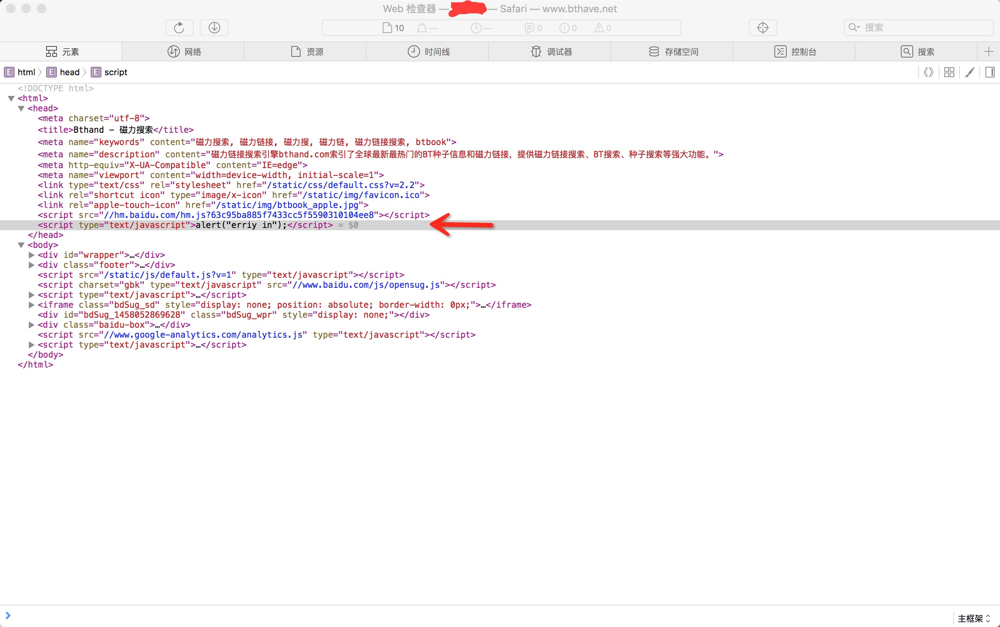
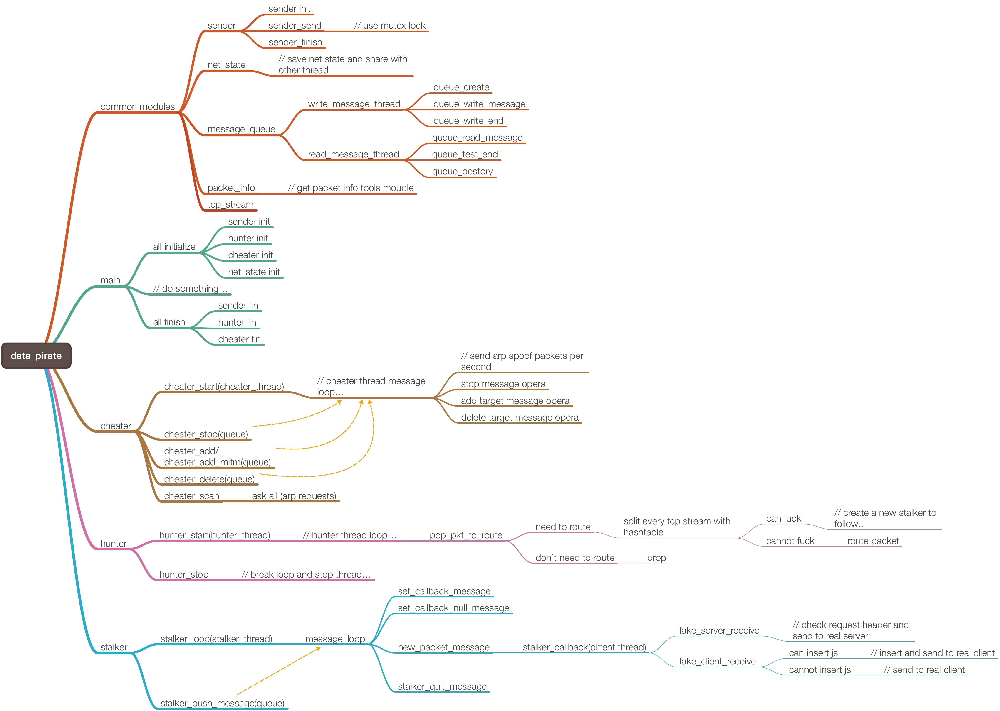

# http动态注入（链路劫持）

## 前置声明

> 1. ***本测试代码仅供安全测试以及网络协议学习之用，由本代码所造成的一切后果，本人概不负责***
> 2. 本代码初始为简单学习tcp协议之用，实现劫持功能并非最简单方式
> 3. 代码写作到后期已经如同搬砖，兴趣索然，由于笔者精力以及知识有限，而且项目学习之中略有感悟，此份代码架构并不优美，结束时会简单描述下我想要达成的那种自我感觉更优美的框架结构
> 4. 本文尽可能的口述化的描述一些问题，可能很多地方并不会使用一些专业化术语，也有可能描述略有偏差，欢迎指出，如果深入学习推荐读者去学习《tcp/ip协议》三卷
> 5. **最后一点，我说什么东西都挺墨迹的，读的时候别着急哈**

email: erriy@msn.com

## 攻击靶机效果图




## 已实现的与没实现的

### 已实现

> - arp攻击
> - 三环路由功能
> - 伪装服务器与客户端

### 没实现

> - 代码残缺，并不一定可运行，仅在本机测试通过
> - 虽采用c写所有核心逻辑，但并未进行移植测试
> - http流报首长度修正
> - chunked 编码插入
> - gzip压缩的数据缓存解压后再进行插入
> - tcp/ip首部校验，判断是否为坏包


## 说点没用的，没兴趣可直接跳过

（自认为）代码写完了，狗啃的一样，屎一样的代码，而且没做内存回收操作。就像魔术一样，你知道了原理，就没有什么乐趣可言了。代码拖了很久拖到最后已经不想写了，但是之前兴趣高昂的时候已经到处扯了，吹过的牛b犹如泼出去的屎，想收回来可以，但是太脏了，所以到现在虽然写的不是很完美，但基本功能均已实现，所以我将它画上句号。我哥问我说写完了有成就感么？我说没有，只有一种解脱感。兴起时，框架重写都很有奔头，兴头过了，敲键盘犹如搬砖，虽然代码不多，但是人的懒惰是无止境的，几个字母都不想敲。

笔者无聊的时候想了一个软件，基于云合作的一种软件，其中各项功能其实很多软件都有了，但是有些软件总是很让人反感，就想自己写一个。电脑在两台以上的时候，互相间的传输很是麻烦，最初只是想写一个跨平台共享剪贴板的后台服务，然后用脑图软件一点一点的增加功能，最终感觉算是一个“个人云”的分布式服务了，这个时候就产生了一个问题，网络编程我并不熟，那么就有必要去搞一搞了。*（Ps：这个代码可能下一步会搞，但是不知道会搞多久了，也不知道兴趣能坚持多久，做的感觉差不多时开源大家有兴趣可以去玩玩，当然现在八字还没一撇）*

一说网络，首先想起的就是socket，但是当初学习socket的时候，感觉很痛苦，各种参数什么的，到底是干什么的呢？特别是udp和tcp，到底有啥区别呢？底下的东西并不清楚，就会导致用起来的时候不是随心应手，出了问题也不好解决。其次是考虑到传输安全的问题，明文传输到底是如何不安全的？为什么都要说加密传输呢？那么再次考虑一下，加密传输这个加密通道怎么打通呢？如果开始时沟通一个密码，那么这个密码本身不也是明文传输的么？那么加密的意义不就没了么？然后一点点的看到非对称加密相关的东西，然后想了种方法，通过服务端保存私钥，客户端连接服务端获取公钥，认证无误后建立连接，客户端通过生成随机密码（高强度）通过公钥加密发送到服务端，然后服务端确认开启这条高强度对称加密通道。自己感觉很是开心，好像发现了什么新大陆一样，然后渐渐的了解的多了忽然发现，原来这跟https的原理雷同，证书认证的基本原理。好了，扯远了。反正就是网络编程很不熟，就搞了《tcp/ip协议》第一卷看了下，也没看完，就看了9章左右，感觉差不多理解了，就开始写测试代码吧。

第一版测试代码是基于linux内核的netfilter框架写的，大约用了两百多行代码，实现了tcp payload替换，将其中比较简短的一些js直接替换为我的js代码，直接alert弹窗。忘了说了，由于本身不属于靶机的物理上层设备，就用arpspoof进行arp劫持来让自己变成中间人。当时写的比较简陋，而且对tcp还是处于一种比较朦胧的状态，测试虽然成功，但是效果并不好，虽然注入成功，但是破坏了网页本身的流程，不能正常加载。

第二版测试代码其实跟第一版很相近，但是代码更多了些，将每个包的状态都进行了解析，基本属于测试学习tcp协议本身的东西吧，测试效果并没有改变。

第三版改动很大，由于一直处于内核层操作，所以有很多很不方便的地方，而且效率问题影响很大，就想到有没有什么办法能让我在ring3很稳定的去搞这些东西呢？还有就是能不能windows端下，osx下，android下，甚至越狱的ios下都能进行链路劫持呢？答案是有的，最简单的方式就是原始套接字监听。下面就是整体逻辑的一些梳理了，进入正题！

## 本版测试代码逻辑

### 本版测试平台

- 系统 ： osx 10.11.3
- 编译器 ：Apple LLVM version 7.0.2 (clang-700.1.81)
- lib库需求 ：lpcap, lnet, lpthread, lz
- （PS : **不能用vmware虚拟机测试，虚拟机的虚拟路由发包与常规网络数据传输方式不同，怀疑为了效率考虑vmware虚拟路由逻辑底层直接进行内存拷贝操作然后经由vmnet驱动解析，但中间人攻击后的数据（非本机IP数据包）并未解析，抓ip包异常之大（不确定，仅猜想，未深入测试）**）

### 以太网&arp&ip&tcp&http简介（非标准化简介）

> **注意：本部分简介只为本测试需要的功能进行解释，介绍并不完整，如想深入了解，请自行学习协议**
>
> 互联网数据传输本质上就是进程通讯，只是这个通讯的速度相对于其它的进程通讯更慢些，丢包率可能更高些。tcp/ip协议栈本身就像多级火箭一样，一级一级的火箭推送只为护送有效载荷（payload）到达目标。***数据排放均为网络字序。***

#### 以太网协议（IEEE802.3）简介

```c
struct _ethhdr
{
    unsigned char   h_dest[6];      // [00][01][02][03][04][05] target mac
    unsigned char   h_source[6];    // [06][07][08][09][10][11] source mac
#define _ETH_P_IP                       (0x0800)
#define _ETH_P_ARP                      (0x0806)
    unsigned short  h_proto;        // [12][13]
  	// payload...
};
```

包的传输以以太网地址（mac）为目标发送，以太网头部包含发送端mac地址，目标端mac地址和携带数据的协议。内网数据交换依照目标mac地址来发送数据。mac地址并非无意义的一串字符，前三个字节代表厂商，通过mac地址扫描即可大致确定目标设备是什么，当一个目标的mac地址为魅族旗下的，很大的可能是魅族手机，而如果是技嘉的，则很大可能是pc（包含笔记本）。下载[mac网卡厂商列表](http://standards-oui.ieee.org/oui.txt)自己做下简单的搜索就行了，不赘述。顺便推荐下读者，没事把自己的mac都改了吧。

#### arp协议简介

```c
struct _arphdr
{
    unsigned short  ar_hrd;   // [00][01]   format of hardware address
    unsigned short  ar_pro;   // [02][03]   format of protocol address
    unsigned char   ar_hln;   // [04]       length of hardware address
    unsigned char   ar_pln;   // [05]       length of protocol address
#define _ARP_REPLY                      (0x0002)
#define _ARP_REQUEST                    (0x0001)
    unsigned short  ar_op;    // [06][07]   ARP opcode (command)
    // use char[] against package
    unsigned char   ar_sha[6];// [08][09][10][11][12][13] sender hardware mac
    unsigned char   ar_sip[4];// [14][15][16][17]         sender IP address
    unsigned char   ar_tha[6];// [18][19][20][21][22][23] target hardware mac
    unsigned char   ar_tip[4];// [24][25][26][27]         target IP address
};
```

地址解析协议，即ARP（Address Resolution Protocol），通过ip获取mac地址的协议，主机发送信息时将包含目标IP地址的ARP请求广播到网络上的所有主机，并接收返回消息，以此确定目标的物理地址；收到返回消息后将该IP地址和物理地址存入本机ARP缓存中并保留一定时间，下次请求时直接查询ARP缓存以节约资源。

本测试通过持续发送arp应答包污染靶机与路由器，使其发送的ip包的下一跳是本机，实现中间人流量劫持（中间人的一种简单实现方式，实际流经的任何一个路由交换设备都是中间人）。


#### ip协议简介

```c
struct _iphdr
{
#if defined(__LITTLE_ENDIAN_BITFIELD)
    unsigned char   ihl:4,version:4;    // [00] Internet Header Length(ihl)
#elif defined(__BIG_ENDIAN_BITFIELD)    // 4bit ip header max length = 0xf*4 = 60 bytes
    unsigned char   version:4,ihl:4;    // [00]
#else
    #error "check __LITTLE_ENDIAN_BITFIELD / __BIG_ENDIAN_BITFIELD"
#endif
    unsigned char   tos;                // [01]
    unsigned short  tot_len;            // [02][03] ipheader and payload len
    unsigned short  id;                 // [04][05] packet number
    unsigned short  frag_off;           // [06][07]
    unsigned char   ttl;                // [08]     time to live
#define _IPPROTO_TCP                    (0x06)
    unsigned char   protocol;           // [09]
    unsigned short  check;              // [10][11]
    unsigned int    saddr;              // [12][13][14][15] src ip
    unsigned int    daddr;              // [16][17][18][19] dst ip
    // The options start here.             [20]~[59]
    // payload...
};
```

IP的责任就是把数据从源传送到目的地。它不负责保证传送可靠性，流控制，包顺序和其它对于主机到主机协议来说很普通的服务。ihl字段表示ip头部长度所占长度／4，一般为5，也就是ip头部一般为20字节，但并不所有都这样，有兴趣着可以去读协议或者rfc文档。tot_len字段表示本报文首部加运载的数据总长度，通过此字段（字序转换）－ihl＊4得出的值是payload部分大小。check字段为校验码，只校验ip首部是否正确。

之前看过几篇文章通过检查id和ttl来判断是否遭遇链路劫持，确实能看出来，但是如果攻击者足够心细的话，是很难检测的。id字段代表发送端ip报文计数器，每发送一个ip报文都自加，有些粗心者在链路劫持时发送的id都是一样的，或者随机乱序的，很容易被发现。至于ttl，某种意义上时经过的路由数的记录，不同系统的初始值并不相同，亦可自行设置，每经过一个路由ttl自减一，如有粗心大意者劫持某个ip时，然后ttl初始为64，反推即可大致确定攻击者位置（也可能经过攻击者篡改，无法确定定位到的是否是真的攻击者）。

路由通过目标ip地址进行转发，若下一跳并不是目标，则选路至最可能是目标的下一路由，此时我们可以推测，如果当前路由装作已到达目标然后发送回应，会发生什么？内网测试hook 99.99.99.99 ip地址成功，通过攻击机伪造tcp和http响应，攻击靶机成功（如下图所示，本版测试代码已删除，历史版本中有）。


#### tcp协议简介

```c
struct _tcphdr
{
    unsigned short  source;     // [00][01]         source port
    unsigned short  dest;       // [02][03]         target port
    unsigned int    seq;        // [04][05][06][07] send sequence
    unsigned int    ack_seq;    // [08][09][10][11] ack sequence
#if defined(__LITTLE_ENDIAN_BITFIELD)
    unsigned short  res1:4,doff:4,fin:1,syn:1,rst:1,psh:1,ack:1,urg:1,ece:1,cwr:1;
#elif defined(__BIG_ENDIAN_BITFIELD)
    unsigned short  doff:4,res1:4,cwr:1,ece:1,urg:1,ack:1,psh:1,rst:1,syn:1,fin:1;
#else
    #error  "check __LITTLE_ENDIAN_BITFIELD / __BIG_ENDIAN_BITFIELD"
#endif                          // [12][13]         doff tcp hdr len
    unsigned short  window;     // [14][15]
    unsigned short  check;      // [16][17]
    unsigned short  urg_ptr;    // [18][19]
    // The options start here.     [20]~[59] mss,wsopt,sack-premitted,sack,tspot ...
    // payload...
};
```

TCP（Transmission Control Protocol 传输控制协议）是一种面向连接的、可靠的、基于字节流的传输层通信协议。（如出错欢迎纠正）我个人曾想过一个问题，tcp协议中涉及到各种各样的算法，那么最重要的是什么呢？是tcp的超时重传容错机制。tcp中涉及的慢启动算法什么的，并非tcp本质，而是一种完善，锦上添花，有必要去学习，好处很多，但此文并不关注。

source和dest字段是端口记录，我曾经非常不理解端口这个东西，看到这就很清晰了，端口号就是一个数字，这个数字与ip共同标识一个tcp数据流，通过系统查表可知这个流是属于哪个应用的。写到这想起曾经学习socket时比较迷惑我的一个问题，NAT转发导致的内网不可穿透的问题，如不了解的可以自行想一下，实在想不出来再自行查资料，此处不赘述。（大牛请自行忽略）

seq字段和ack_seq字段曾经迷惑过我一段时间，sequence是顺序的意思，seq标示着发出去的包的序号，接收端可通过序号进行重组，每发送多大数据，下一个seq就是本seq＋当前包发送的payload数据大小，通过seq－初始seq可知已发送数据大小（syn，fin包例外，本身占一位）。ack_seq代表本端已接收到的数据，目标端下一个seq应该为多少。更形象一点来说，seq与ack_seq实际上维护了两个内存空间，本端发送的初始seq和当前seq代表本端已发送的内存空间数据，对端发送的初始seq和本端发出去的ack_seq代表着本端已接收到对端的数据多少（包含syn，fin包）。

doff代表tcp头部所占32位空间大小，doff＊4为本tcp首部所占内存大小，由于doff最大为0xf，则tcp首部最大为0xf＊4=60bytes。其他标志位本文只关注syn，ack，fin，rst。三次握手经常听到，但是也没有去怎么深入了解过。啊，首先还是说下ack吧，Acknowledgement，确认字符，此位段代表ack_seq字段有效，确认已接收到某部分数据。然后来说三次握手：

> 1. client通过发送syn（synchronous 同步）包给server，由于此时并未接收到server发来的数据，所以ack未设置，ack_seq无效。当前发送的seq为本地发送的初始序列号，可理解为随机生成（深入研究还有点规律，此文忽略），携带一些附加选项（同步用附加选项一会细说）
> 2. server接收到client发送的syn包后，发送自己的syn包给client，由于client已经传输了数据，所以server要告诉client本地已经收到了，ack字段设置，ack_seq＝client发送的seq＋1（***再次强调网络字序问题***），表示我们已经收到ack_seq－client.seq ＝ 1数据（并非syn包携带数据为1字节），顺便生成了当前tcp流的初始seq，携带一些同步用附加选项（tcp全双工）
> 3. client收到server的syn&ack包之后，同样发送个ack给server确认已收到，此时tcp连接已建立。

连接已建立了，那么这是就会想到，如果连接没建立起来呢？syn-flood攻击的原理你就理解了。不赘述，有兴趣自行了解。

链接建立后开始传输数据，由于考虑到效率问题，不可能只发送一个包等待确认之后才会继续发送下一个包，这时引入滑动窗口的概念，window字段，选项头中的sack，sack-premitted，wsopt，mss字段。

syn包时选项头部包含了很多，由于window字段为short类型，能表示的最大值为65535，但缓冲区大小可能远大于此值，特wsopt选项部分表示窗口大小的倍数，wsopt的值代表window右移的位数，也就是扩大了2的wsopt次方倍。例如window＝1024，wsopt＝14（取值0～14），则代表本端滑动窗口为1024<<14。发送端无需接受确认即可发送当前滑动窗口大小的数据，窗口起始地址为当前以被确认（ack）的数据。一同发送这么多数据是有很大隐患的，此时引入sack机制，syn时sack-premitted表示当前端是否支持sack功能，双方均支持才产生实际作用。sack提供选择性确认技术，即你说了那么多，但是我中间丢／坏了几个包，你把中间那几个包发给我，后边的一段范围内的我都收到了，对端就会重新发那几个包。window的值是不确定的，可能由于本地的缓存变小而不断减小，当接收端window为0时发送端等待。（关于选项包括sack的部分，自行了解，不赘述）。

tcp好像差不多了，剩下的就是关闭tcp连接了。由于此连接是双工的，所以关闭时两端都要发送fin，当然也是可以单向fin的，表示本端不再继续发送数据了。四次挥手不赘述，有兴趣自行查阅。

最开始说tcp时想的远一点的读者就能想到一个猥琐的想法了，端口这个东西只是个数字，那么这个数字不是也能做一些文章么？一个木马与远控端沟通时打通的tcp通道，经常容易被端口检测工具检测到。那么我们就要做端口隐藏，深入到系统更深层次的hook，那么我们能不能更简单一点的采用***端口寄生***技术呢？不在本地再次开端口，而是采用本地已有应用已经打开的端口去发送我们的数据呢？通过原始套接字抓包监听是否为我们所要的包，如果你自身不监听的话，网络驱动会认为此包无效自动丢弃。我们通过自己设置的seq规则，或者说直接在ip选项部分或tcp选项部分加入自己的标识，那么这个流的提取不成问题。问题在于会不会干扰正常流的接收。此方法我并未测试，但感觉非常大的可能性是可行的，即便tcp不行，我们也可以采用udp打穿内网限制，像qq一系列的基本上很多电脑都有，udp端口伪造很简单，而像服务器之类的，端口伪造就更简单了，肯定是有固定端口开放的，不然就不叫服务器了。

tcp的非正式介绍告一段落。

忘了说一个rst，非正常关闭，唉，懒得介绍了，自己查吧，强制关闭，相信大家在fq的时候了解过这种东西。（感觉自己好不负责啊。。。）

#### http协议简介

超文本传输协议（英文：HyperText Transfer Protocol，缩写：HTTP）是互联网上应用最为广泛的一种网络协议。设计HTTP最初的目的是为了提供一种发布和接收HTML页面的方法。通过HTTP或者HTTPS协议请求的资源由统一资源标识符（Uniform Resource Identifiers，URI）来标识。

http依赖于tcp，https依赖于ssl/tls，https不赘述，加密的，这个模块日不了，也是可做攻击的，比如我了解过的https降级攻击和证书伪造攻击，有兴趣可自行了解。

http request（请求）本文只介绍两个个：GET，POST。

首先说我不是专门搞web的，所以这两个介绍可能比较呆板，而且可能有错误导向，欢迎指正。

// 以下一段可能产生误导，勿偏信

GET请求一般常用于跟服务器索要相应的资源。POST一般用于提交什么表单什么的。这种方法是服务器的约定，我也可以自己写个http服务器就特例化非要玩点不一样的，我就POST不这么干，我GET也不这个意思，甚至我非要用gets来代替，倒是也行，但并不统一化（你还得自己在写个浏览器，加载页面时的所有uri你都用POST去加载）。

Cookie，cookie劫持这个挺多人说的，原来我也不了解，由于网络本身无法确定对方真的是谁，而每次都要输入密码还会让人很不爽，所以http协议支持设置cookie存于本地，用于标识身份，相当于一个临时身份证。这个cookie被劫持了，即便不知道用户名密码，一样可以登录上去。

GET / HTTP/1.1\r\n 请求成三段，GET 为方法，／为uri资源标识符， HTTP/1.1代表http协议1.1版。uri中常见的有这种形式的 /?type=xxxx&mode=xxx，？前的为请求资源标识，后面的是参数，各参数用&连接在一起。比如sql注入中常见的在标题栏输入的测试 /?id=xxxx and 1=2，看反馈是否与正常不同。

Host字段，由于当前访问的ip可能存在多个域名，那么单纯GET中的uri就不足以确定请求的资源是什么了，Host字段也给我们个方便，直接与uri拼接即可分析出当前靶机访问的页面。

If-Modified-Since 和If-None-Match ，这两个字段可能导致服务器端并不会重新发送回请求的数据。字面理解第一个标签，如果修改了，表示本地已经缓存了这个资源，如果服务器端的这个资源没改变，则不用重发，直接发回304，那么这个资源就不用重新再发一遍了，减少了网络传输压力，但是我们也哭了，因为这样的话我们就没有办法修改了。第二个自行去看吧。（汗。。。）

Accept-Encoding，表示我们接受什么样的数据传回，是否支持压缩数据，本测试代码比较懒，不想彻底写一遍tcp协议了，就设置了none，返回的数据很可能就不会是压缩的了（有些流氓他不管你是不是none，反正我就返回压缩的，你打我啊？），这样我们就能直接插入我们想要的代码了。如果是压缩的，也是能搞的，尾部我会介绍一些其他的方案，本测试代码方案并不完美，也并不简单，更不高效，本测试代码只是为了更深入了解协议栈所做的一些妥协，其实不这么做也能把事情搞了。

http response部分，主要是看Transfer-Encoding: chunked字段、Content-Length字段和Content-Encoding字段，返回值自然不用说了哈。

Transfer-Encoding: chunked字段和Content-Length字段对应关系，只有其一生效，如果一起会发生什么，我不知道，你自己试下吧。chunked编码是一种不确定长度的传输方式，也就是说我并不知道我要传输多少数据。Content-Length就定长了。Content-Length本身表示整个报文首部后面的数据长度，接收端依次标签确定是否接受完了。chunked可以用一种现象很好的感觉出来，比如浏览器下载的时候，经常碰到不知道文件多大，不知道什么时候能下载完的情况，这就可能是chunked编码导致的（不确定，应该是，没去抓包看过）。chunked编码的好处在于其不定长的数据传输方式，比如我的页面是动态生成的，那你就一定要等我生成完毕才能发么？这个等待时间虽然很少，但是网络延迟有时已经很高了，我们尽可能的让客户端少等待一点。于是我生成出来多少就发送多少。也可能是压缩，为了压缩传输如果定长的话我就一定要等待压缩完毕才能去发送。chunked编码很简单，16进制可打印字符标记当前chunked段的长度，然后\r\n，随后跟这么长的数据，然后下一chunked。以为0字段的chunked表示结束。

这时我们应该已经很清晰了，如果我想动态的插入代码，那么我需要修正Content-Length或者chunked标识长度的字段（本测试代码并没有做修正。。。懒得做分析了。。。好一种破罐子破摔的感觉。。。）。

好了，一时就想到这么多。

### 代码逻辑简介

将攻击机为靶机与服务器的中间人（本测试通过arp简单实现，双向arp欺骗），整个劫持过程的输入采取类似嗅探器的原理，由于数据本身流经本机，所以并不用开启网卡混杂模式（开了混杂其实也没用，现在的路由设备发包并不广播，也就是说其他mac地址的数据并不会嗅探到），但由于各个系统开启路由转发方式并不相同，所以本劫持的输出部分为发出以太网数据包，劫持模块中包含ip地址判断，非发往本机的数据包通过发原始包形式转发到下一跳。简而言之，用嗅探和原始包发送做了个用户层的路由功能。

路由之前判断，若tcp流目标端口或原始端口为80，则认定为http数据流，开始http劫持模块。

http劫持包含两部分，一是是否需要劫持的判断，二是已劫持的流的维持和后期校正。这中间就有个需求，需要将数据分流，本代码采取hash表的形式分流，以原地址和目标地址抑或、原端口和目标端口抑或直接过再次求checksum为hash索引，为了效率以及代码简单性考虑（单线程延迟很高，未做效率优化，判断异常啰嗦），每个流对象都使用stalker开启新线程追踪（若考虑并行，可采取线程池轮流处理单个流对象）。

stalker中封装线程部分，通过回调函数来进行实际的逻辑处理，由于tcp流的全双工性质，设置中间过滤层（类似水坝），单向劫持发送伪造应答，一定条件后开闸泄洪，发送经本机修改后的伪造请求／应答给目标机器。

### 架构简图



### 模块理顺

#### main(thread)

> 主线程主做模块初始化引导功能，平台相关性很大，除去启动核心逻辑外，无太多实际功能。

#### sender

> sender模块主做原始包发送，本测试代码采用libnet进行发送，不支持的平台可直接采取原始套接字发送。

#### net_state

> net_state主做保存网络状态的事宜，由主线程初始化，设置本地网络状态，提供其它各线程网络状态或目标地址查询功能

#### queue

> 此模块主要做多线程通信之用，只做了最简单的双进程单向通讯，生产者消费者模式，一个写线程一个读线程，算是单工模式吧。中途有一次自己模拟ipc进程通讯机制写了个itc线程通讯模块，通过双向queue来进行全双工沟通，但由于使用起来过于繁琐，就扔了。

#### packet_info

> 解析数据包模块，类似linux netfilter框架中的sk_buff对象，但并未进行优化，由于为测试代码，并不知道自己可能用到多少功能，所以获取每个信息的时候都是重新运算的。做效率优化可以直接做成构造函数中解析，然后直接读成员变量就好了，效率能高很多。

#### tcp_stream

> 此模块主要做分流操作，分流原理上文已说，通过hash表分流（未做回收操作，懒得做了）

#### cheater(thread)

> 通过主线程初始化，初始化后工作于另一线程，提供调用着接口，接口通过queue与线程沟通，线程循环主要做arp欺骗架起中间人工作。

#### hunter(thread)

> 通过主线程初始化，本模块采用libpcap抓包库实现，可能有些平台并不支持，android下可采用原始套接字抓包嗅探，已在sony z1 compact（已root）测试成功，采用原始套接字嗅探（要求root），采用linux下的arm-none-linux-gnueabi-gcc工具链编译arm原生程序，通过终端模拟器还有adb调用均测试成功（亦可采用ndk编译，通过java层调用，先申请su权限）。本模块主做抓包功能，做router的输入。

#### stalker(every different thread)

> stalker采用并发编程（非并行），是用pthread库，windows下需要自行添加pthread库，或重写此部分功能（代码垃圾的很，移植这破代码太不值了，看看然后自己写吧）。由于pthread本身并不支持线程休眠功能，所以采用互斥锁实现睡眠与唤醒，通过queue实现caller与stalker异步沟通，stalker队列循环中若无消息则自行睡眠，caller推送消息时自动唤醒stalker，主要功能实现处于stalker callback中。

### 其它方式的一些小思路

#### arp攻击思路

```c
           ->->->->->->->->->->->->->->->->
         /                                  \
0.      cli                                ser
         \                                  /
           <-<-<-<-<-<-<-<-<-<-<-<-<-<-<-<-

           ->->->->->->->    ->->->->->->->
         /               \  /               \
1.      cli <<<<arp>>>>  mitm  <<<<arp>>>> ser
         \               /  \               /
           <-<-<-<-<-<-<-    <-<-<-<-<-<-<-

           ->->->->->->->->->->->->->->->->->->
         /                                      \
2.      cli            dnsspoof   <<<<arp>>>>  ser
         \               /  \                   /
           <-<-<-<-<-<-<-    <-<-<-<-<-<-<-<-<-

           ->->->->->->->                   ->->->->->->->
         /               \                 /               \
3.      cli <<<<arp>>>> (proxy/NAT)(new cli)              ser
         \               /                 \               /
           <-<-<-<-<-<-<-                   <-<-<-<-<-<-<-
```

如上面的情况所示

0代表正常的tcp流

1. 是目前测试代码中的方式，我们通过双向欺骗，告诉客户端我们是服务器／路由器，告诉服务器／路由器我们是客户端。然后流经过我们之后才会传到对方。
2. 是一种dns污染模式，我们单向欺骗服务端／路由器说我们是客户端，所有去往客户端的流量都被劫持，此时我们做单向路由，把正常的数据都继续转发给客户端。然后到dns解析时我们直接将dns应答结果替换成我们的ip地址，这时这个链接就是一个伪造的服务端连接了。中间人通道成功架起。
3. proxy代理模式，或者说NAT转发模式，这种模式下我们只欺骗客户端说我们是路由器／服务器，客户端的所有流量都在我们的掌控之下，此时我们即是靶机的上层设备了，可以直接模拟路由进行NAT转发操作，也可直接提取链接，然后开启一个服务去正常访问服务器，然后将返回结果再次重新返回给靶机，中途自然你想做什么就做什么了。

至于其它的中间人攻击方式类似dhcp，dns什么的，请自行了解，不再赘述。当然，你要本身就是个网关，这些事情就不用考虑了，但了解下还是必要的。

#### 我设想过的一种自认更好的架构和实现方式

前面说过本测试代码本身是为了学习tcp协议而写的，并非为了真正使用，再说一句废话就是，这个东西不仅仅可做坏事，比如动态挂马什么的，更可以做流量控制和访问限制，况且如果不曾了解攻击方式，那么我们自然也无法去防范这些事情，所以我认为无论你是否对此感兴趣，都有必要学习一下。扯远了，回来继续。

我曾设想过一种架构，算是一边学习一边产生出来的想法。说出来见笑了。

写这个模块中途我去了解过一些chrome的架构设计模式介绍，它的这种进程消息传递机制当时给了我很大的震撼，虽然这种东西很常见，但是之前却很少注意到它。当时我在写分tcp分流模块，然后就彻底改了一下分流部分，添加了双线程读／写队列，将处理与分发完全异步。当时的一句话很震撼，大意是一个好的架构可以让开发更简单，使用起来可以更肆无忌惮。唉？好像扯远了。回来。

所有的模块，用面向对象的思想来看，所有的东西都要有两种东西，数据和方法。方法的本质是处理数据，我们在方法上再次分类，分为外部处理方法和内部处理方法。内部处理可以直接理解为引擎，外部处理方法可以理解为沟通。沟通再次分类就可能有两种，输入与输出。分到这里，我们所有的东西都可能需要用的东西就出来了，可能有数据，可能有内部处理方法，可能有输入，可能有输出。从函数到内存处理到计算机本质，甚至各种工具（比如车的引擎，输入油，通过引擎内部“函数”处理，输出动能和热能以及尾气），以及人的本身，都这么几种方法。扯远了，倒是感觉越来越理解Object类了。我们的每个模块都可以设置成object类型，提供输入输出与内部处理，将内部完全封装，通过一种自定义的通讯模式，噢，不，通讯模式本身也封装成这种类型，组成一个拥有以下几个具象功能的类：

- 进程／线程／模块沟通类
- 抓包类
- 发包类
- 处理类
- 输出类（输出到文件、ui刷新等等）
- 线程／进程／模块类

通过主模块启动抓包类模块，通过抓包类模块启动处理类模块，处理类模块处理完成后调起输出类，输出自行决定是否dump，是否调用发包类发出去，是否发送到主模块进行ui刷新。所有模块都继承于沟通类和线程／进程／模块类。每个模块都可能是一个线程或者一个单独的进程，或者其它的不同的语言写的操作的模块，遵循一些协议。

再具象化到这个真实的程序，以下所有均为异步操作，通过消息机制传递。我们可以将嗅探和发包还有输出写成服务，自我定义一系列消息结构体来传输消息。我们可以在写一个arpspoof（本来就有这个程序），自己去调用我们自己写的发包服务来进行arp污染操作。我们在写一个路由模块，通过嗅探服务接收到的数据进行处理判断，发送至输出类，输出通过消息类型判断是否是需要dump的，是否是需要发出去。（PS:我不知道printf本身是不是多线程无锁的，如果printf本身就是有锁的，那么我的测试代码中不止发包时有锁，logout时本身就是一种互斥行为，但如果把所有的消息都弹出到异步输出类中统一处理，即可效率最大化，再ps：消息传递本身可能会有损耗，这就要看情况进行优化了）。

还有一个就是更实际一点的代码优化了，测试代码本身就要在中间做filter做大坝拦截缓存的，但是由于懒惰问题我并没有进行缓存处理。这种情况下，其实我们主要搞一个fakeserver就好了，维持与靶机的沟通，做一个虚假的中间缓存服务器。然后另一方面把dump出来的请求通过socket直接正常与服务器沟通，把接收的数据通过我们的fakeserver发回客户端。不画图了，就这样吧。

### 代码总结

说到这里基本上逻辑已经理清了，代码本身就不说了，我的代码本身很垃圾，有兴趣的倒是可以大致看那么一眼，我总觉得主要是思路理清了比代码看得明白更重要。希望读到这里的你没感觉失望，如果能帮助到你，实在是一件值得快乐的幸事。

## 防止链路劫持安全建议

我曾笑着跟朋友开玩笑说，了解了越多的网络，就越发现安全是那么脆弱。有很多人并不注意安全，或者说有很多人都只注重软件安全却忽略了其他的比如网络安全。我之前玩过一个android软件，打开大致看了下加了360的壳，然后懒得分析，直接用我的ring3路由内网arp攻击后抓包，全是明文的，而且还非常简单的表单，不到两分钟就直接破了。这是个小的“福利”软件，个人作坊做的，我真的很想提醒他被爆菊了。

### 开发篇

> 1. 通讯一定要加密！最好使用比如openssl这种方式，当然你有精力并且技术足够完全可以自己写，即便不是也最好把关键的地方加密
> 2. 登录相关一定不要明文传输，最好存储散列摘要，最好自己外面再添加一些别的独有的信息，防止直接从别的社工裤拖散列登陆
> 3. 收到的数据要校验！自己在自己的数据中插校验散列值，防止被盯上了，一段时间一换方式，不要采用大众都使用的方式

### 平时使用篇

> 1. 密码一定要不同，即便有很多相同的，也要把重要的几个密码单独设置
> 2. 不要为了某些原因就去使用不可信的代理服务器，即便使用，记得用隐私模式，不要做登陆相关的操作，防止中间代理服务器嗅探
> 3. 使用强力防火墙，有些杀毒软件很有意思，默认不开防火墙
> 4. 公共wifi安全性很低，尽可能不要做任何有关个人重要事情的操作。
> 5. 自家wifi定期检查，最好设置mac白名单，关wps／qss功能，使用高强度密码，包含各种符号，16位以上
> 6. 不要使用不可信任的浏览器插件
> 7. 定期清理缓存，防止缓存投毒

好了，就这些，感觉以上都是废话，其实我说完了我本身都不会这么做，我已经破罐子破摔了，希望没有人盯上我。。。

## 总结（最后那么一点点废话）

勿以善小而不为，勿以恶小而为之。好坏之评定非常困难，希望大家都有自己认为更好的价值观。我们每个人都做过不少坏事，但不能因为自己做过坏事就觉得虱子多了不嫌痒了，我本身并不是什么好人，不能说什么太高尚的话。我希望大家能在做什么之前想起我最近经常想的一个问题：为什么现实社会中你不会去偷别人东西而虚拟网络中就会想做这样的事情呢？是现实社会中的惩罚来得更直接，给你的恐惧驱使你不去做么？那么也许在网络上才真正能体现一个人的本性吧。

谢谢你的耐心阅读，希望有帮到你。


